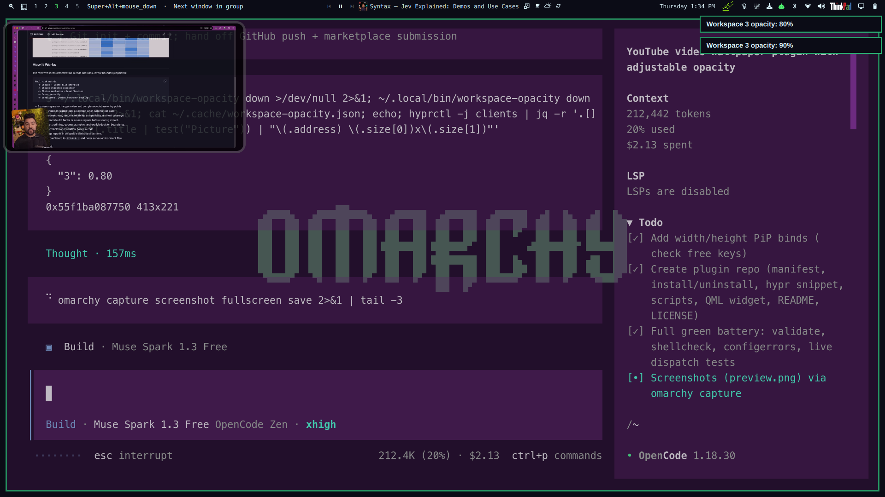

# PiP Video for Omarchy

YouTube picture-in-picture, fixed up: rounded corners and a grabbable border
instead of the sharp-edged default, resize it with `SUPER` + touchpad pinch or
`SUPER+ALT` + `H`/`L`/`J`/`U`, play any YouTube video as your wallpaper, and
fade each workspace translucent to watch it behind your apps.



## Features

- **PiP polish** (Chromium + Firefox): floating, pinned, 12px rounded corners,
  4px resize border, pop-in animation.
- **Resize the video**: `SUPER` + 2-finger pinch (live), `H`/`L` shrink/grow
  (16:9 kept), `J`/`U` shorter/taller, or `SUPER` + right-click-drag.
- **Video wallpaper**: copy a YouTube URL, `SUPER+ALT+V` — it plays behind all
  windows via `mpvpaper` (streams through `yt-dlp`). Pause/mute/stop included.
- **See-through workspaces**: `SUPER+CTRL+[` / `]` fades every window on the
  current workspace; each workspace remembers its own level.

## Keybindings

| Key | Action |
|---|---|
| `SUPER+ALT+H` / `SUPER+ALT+L` | PiP smaller / bigger (aspect kept) |
| `SUPER+ALT+J` / `SUPER+ALT+U` | PiP shorter / taller |
| `SUPER` + 2-finger pinch | PiP grow/shrink live (hold `SUPER` first) |
| `SUPER+ALT+V` | Video wallpaper from clipboard URL |
| `SUPER+ALT+C` | Stop video wallpaper |
| `SUPER+ALT+P` / `SUPER+ALT+B` | Pause/resume, mute/unmute video |
| `SUPER+CTRL+[` / `SUPER+CTRL+]` | This workspace more/less transparent |
| `SUPER+ALT+BACKSPACE` | Reset this workspace's transparency |

## Requirements

- Omarchy with the Quattro shell (manifest `schemaVersion` 1) + Hyprland
- `mpvpaper` for video wallpaper: `omarchy pkg aur add mpvpaper`
- `yt-dlp`, `socat`, `jq`, `wl-clipboard` (preinstalled on Omarchy; the
  installer warns about anything missing)

## Installation

Plugins run as unsandboxed code. Review it before you enable it.

```bash
omarchy plugin add https://github.com/ArtMoreno/omarchy-pip-video.git --enable
cd ~/.config/omarchy/plugins/artmrn.pip-video
./install
```

`./install` asks for confirmation, then symlinks the three helpers into
`~/.local/bin` and appends two managed `dofile` blocks (backed up first) to
`~/.config/hypr/hyprland.lua` and `~/.config/hypr/bindings.lua`. It validates
with `hyprctl configerrors` and rolls everything back on failure. Rerunning is
safe. Non-interactive: `./install --yes`.

Checkup anytime: `omarchy-pip-video doctor`.

## Removal

```bash
cd ~/.config/omarchy/plugins/artmrn.pip-video
./uninstall
omarchy plugin remove artmrn.pip-video
```

`./uninstall` removes the symlinks and the managed config blocks, then
reloads Hyprland. Your `*.bak` backups stay where they are.

## How it works

- `hypr/pip-video.lua`: a named window rule for both browsers' PiP titles
  (takes precedence over the stock rule) plus the live pinch gesture.
- `hypr/pip-video-bindings.lua`: all keybindings; helpers resolve through
  `~/.local/bin`, so the file works on any machine.
- `bin/video-wallpaper`: `mpvpaper` wrapper (set/clip/stop/pause/mute/status).
- `bin/workspace-opacity`: per-workspace opacity levels via `set_prop`.
- `bin/omarchy-pip-video`: `doctor` (used by the shell service on load) and
  `status`.
- `Service.qml`: runs the doctor once per shell start so a half-installed
  plugin says what is missing instead of failing silently.

## Tests

```bash
./tests/run.sh
```

Spawns a throwaway window titled like a PiP and exercises every resize path,
the opacity set/reapply/reset cycle, input validation, the manifest, and
`configerrors`. Exits non-zero on any failure.
